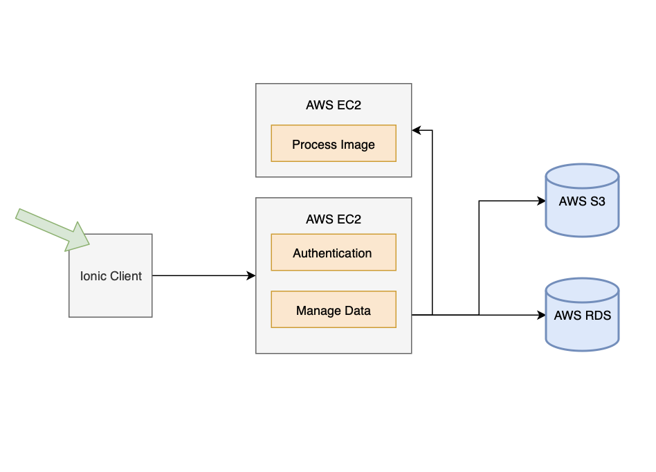

# Front End Server

@TODO: Complete Readme

You can build it with ng or with ionic and put the www files into S3 and serve with cloud front, or you could dockerize it and
serve it in Elastic Beanstalk.

## Authors
This repo was forked from Udacity's GitHub page as per the assignment
[udacity/cloud-developer](https://github.com/udacity/cloud-developer/tree/master/course-02)
* Udacity Cloud Developer authors: **[Udacity](https://github.com/eddyudacity)** and **[Michele Cavaioni](https://github.com/Udacavs)** for their *initial work*
* Udacity Cloud Developer student: **dSalazar10** for my participation in the exercises

## License

This project is licensed under the MIT License - see the [LICENSE](https://github.com/dSalazar10/App-Udagram/blob/master/LICENSE) file for details

## Acknowledgments

* Hat tip to [Gabe Ruttner](https://github.com/grutt) for teaching the lesson and providing the instructions to complete the assignments.
