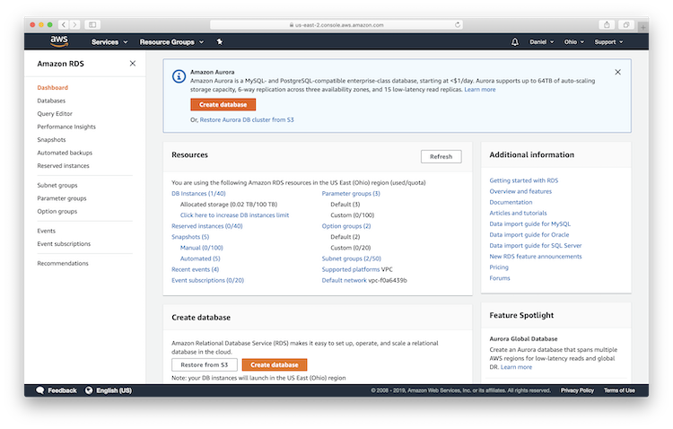
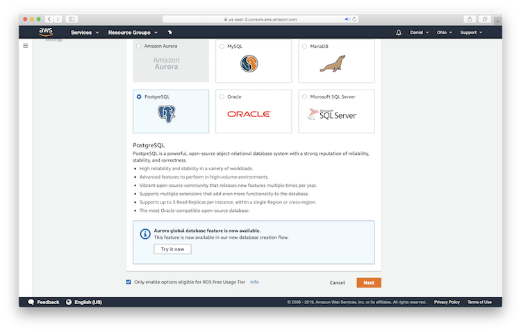
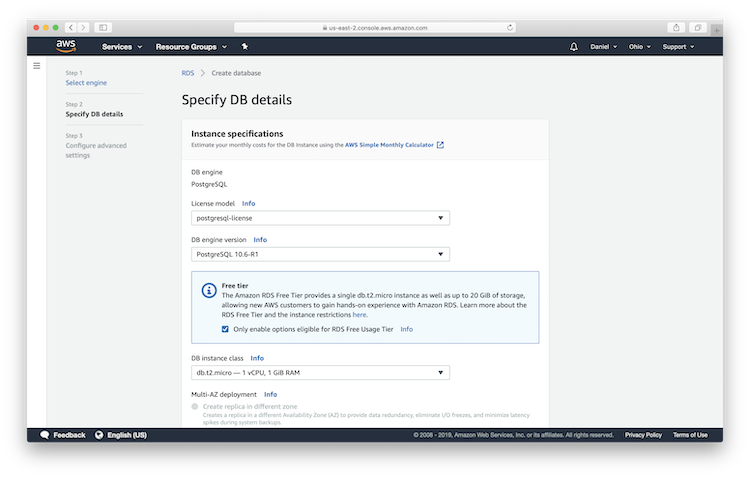
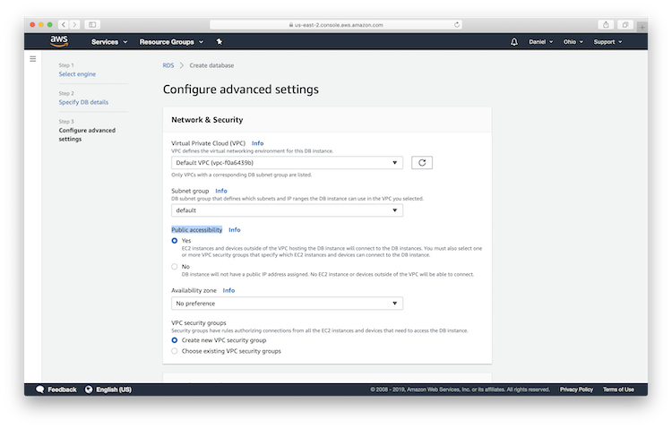
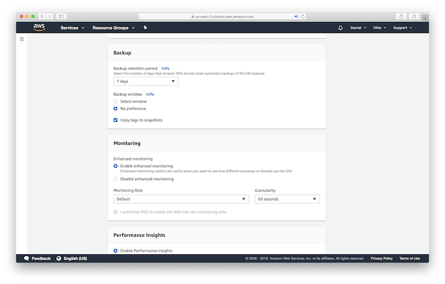
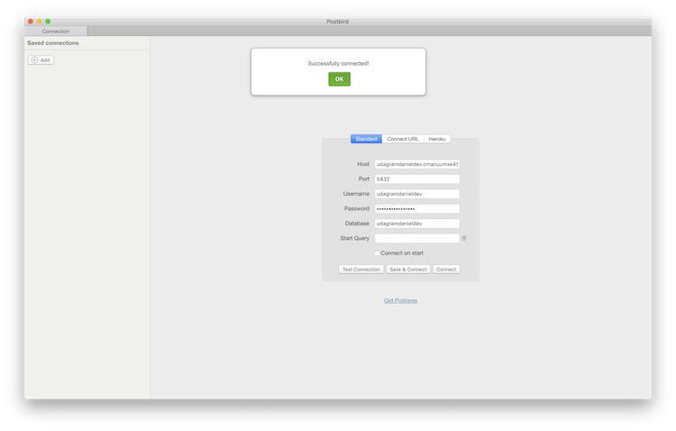
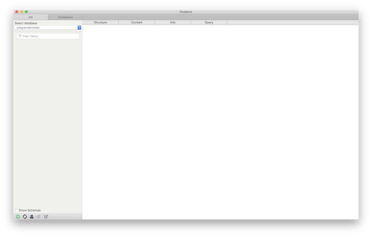
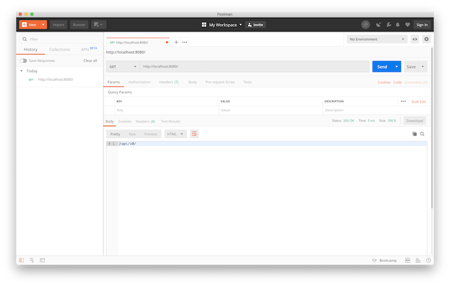
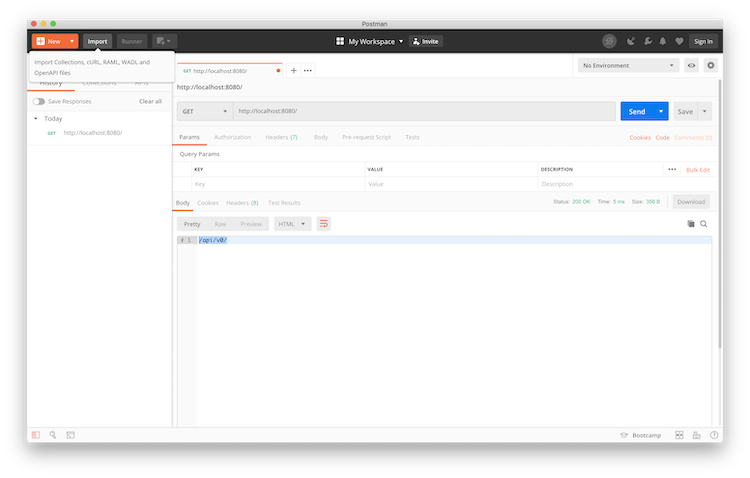

# Image Filter Server

The Image Filter Server is a nodejs/typescript cloud server which
* Manages user authentication, storing emails and password hashes in an AWS Relational Database Service (DB)
* Manages Image Filtering

---------------------------------------------
### **TABLE OF CONTENT**
* [Prerequisites](#prereqs)
* [Setting up the database](#setting-up-database)
* [Setting up Postbird](#setting-up-postbird)
* [Setting up an AWS User Account](#setting-up-account)
* [Local Deployment](#setting-up-local)
* [Running the local tests](#local-testing)
* [Cloud Deployment](#cloud-deploy)
* [Running the Cloud Tests](#cloud-testing)

---------------------------------------------

### Prerequisites

See the [wiki](https://github.com/dSalazar10/App-Udagram/wiki/Getting-Setup) for instructions on installing the following:
* Nodejs and NPM
* Postman
* Postbird
* Visual Studio Code
* Amazon Web Services Account
* AWS CLI

## Getting Started

These instructions will get you a copy of the project up and running on your local machine for development and 
testing purposes. See deployment for notes on how to deploy the project on a live system.

### Setting up the database

* Go to the main page of AWS [here](https://aws.amazon.com).
* Sign into your console
* Click the Services button.
* Search for RDS and click RDS

* Click ‘Create Database’

  - Select PostGres SQL
  - Check the radio button “Only enable options eligible for RDS Free Usage Tier”
  - Click next
  
* Database Details:
  - Keep the Instance Specifications at their default settings. Be sure that your DB instance class is ‘db.t2.micro’
  
  - Settings - Enter a DB Instance Identifier, a Master username, and Master password
    
  - Network & Security - set Public accessibility to yes and keep the rest of the settings default
    
  - Database options - enter a database name and keep the rest default
    
  - Backup – keep everything default
  - Monitoring – keep everything default
  
  - Performance Insights - keep everything default
  - Log exports – select Postgresql log
  - Maintenance - keep everything default
  - Delete Protection – be sure the radio button is checked and click Create Database
  
  - Navigate to the database to obtain the endpoint url
  
  

### Setting up Postbird

* Open Postbird

* Copy and paste the endpoint, username, password, and database name

* Click the “Save & Connect” button

* Now your Database setup is complete. Great job!

### Setting up an AWS User Account

* Navigate to the AWS home page and search services for IAM

* Click the ‘Users’ button in the navigation bar on the left
* Click the ‘Add user’ button
* Type in a new user name
* Click the ‘Programmatic access’ radio button

* Click next
* Click the ‘Create group’ button

* Click the ‘Create policy’ button

  - Click the ‘Choose a Service’ button 
  
  - Type in “S3” and click the S3 button
  - Click the ‘All S3 actions (s3:*)’ radio button
  
  - Click the ‘Response’ tab
  - Click the ‘bucket’ tab’s ‘Add ARN’ button
  
  - Enter your S3 bucket name in the text box and click ‘Add’
  
  - Click the ‘object’ tab’s ‘Add ARN’ button
  - Enter your S3 bucket name for the ‘bucket name’ field
  - Click the ‘Any’ radio button for the ‘object name’ field
  
  - Click ‘Add’ 
  - Click ‘Review Policy’
  - Add a name for your policy
  
  - Click ‘Create Policy’
* Now go back to the tab you started in and enter the policy name you just created

* Enter a name for your group
* Click the refresh button and search for the policy you just created
* Click the radio button next to your policy and click ‘Create Group’
* Click ‘Next’
* Click ‘Next’
* Click ‘Create User’
* Click the ‘Download .csv’ button to download your credentials

* Click ‘Close’
* For instructions on how to configure the Amazon Web Services Command Line Interface (aws-cli) go 
[here](https://docs.aws.amazon.com/cli/latest/userguide/cli-chap-configure.html).

### Local Deployment

* Clone the repo

* Open the Image_Filter_Server folder in Visual Studio Code

* Open a new terminal in Visual Studio Code
* To install the project’s dependencies, type in `npm i` and press enter

* To start the server, type in `npm run dev`

* The server can be located at `http://localhost:8082`

### Running the local tests

* Open Postman and close the startup menu
* Type in ` http://localhost:8080/` and hit send

  * Here we see the root response telling us that the api is located at /api/v0/
* You can import the provided test collections
  * Click the ‘Import’ button in the upper left
  
  * Click the ‘Choose Files’ button
  
  * Navigate to the Image_Filter_Server Server folder `App-Udagram-master > Image_Filter_Server`
  * Open ‘Image_Filter_Server.postman_collection.json’ file
  
  * Click the ‘Collections’ button, below the ‘Import’ button
  
  * Here you will find three folders to test different features

Public:
- test getting all the images in the feed
- test getting a specific image
- test creating a new user with valid credentials
- test creating a new user with invalid credentials
- test loggin in with valid credentials
- test loggin in with invalid credentials

Unauthorized:
- test posting an image with invalid credentials

Authorized: 
- test posting an image with valid credentials and a malformed payload
- test posting an image with valid credentials and valid payload

## AWS Cloud Development

### Cloud Deployment

@TODO: Complete Cloud Deployment Tutorial

### Running the Cloud Tests

@TODO Complete Cloud Testing Tutorial

## Authors
This repo was forked from Udacity's GitHub page as per the assignment
[udacity/cloud-developer](https://github.com/udacity/cloud-developer/tree/master/course-02)
* Udacity Cloud Developer authors: **[Udacity](https://github.com/eddyudacity)** and **[Michele Cavaioni](https://github.com/Udacavs)** for their *initial work*
* Udacity Cloud Developer student: **dSalazar10** for my participation in the exercises

## License

This project is licensed under the MIT License - see the [LICENSE](https://github.com/dSalazar10/App-Udagram/blob/master/LICENSE) file for details

## Acknowledgments

* Hat tip to [Gabe Ruttner](https://github.com/grutt) for teaching the lesson and providing the instructions to complete the assignments.
