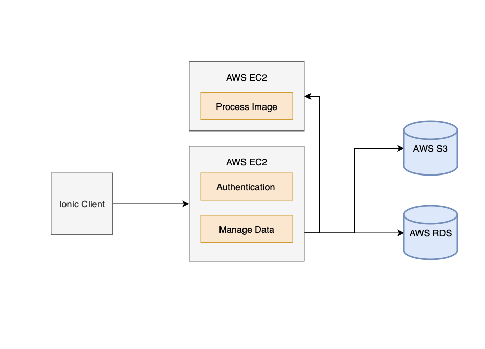
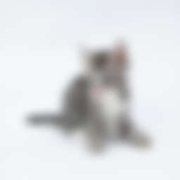
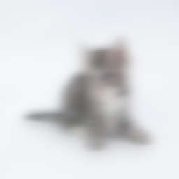

-------------------

This repo contains answers to the assignment. If you are currently taking the course, spoilers beware!

## Endpoints

### Rest API

Base URL for Rest API is http://udagram.me/api/v0

/feed
  - `GET /` get all images
  - `GET /:id` get a specific image
  - `GET /signed-url/:fileName` (requires auth) get signedURL
  - `GET /` (requires auth) upload an image
  - `PATCH /:id` (requires auth) update a specific image

/user
  - `GET /` reserved
  - `GET /:id` get a specific user
  
 /user/auth
  - `GET /` reserved
  - `GET /verification` (requires auth) verify credentials are valid
  - `POST /` register a new user
  - `POST /login` login

 ### Image Filter
 
 Base URL for Image Filter API is http://filter.udagram.me/api/v0
 
 /filter
   - `GET /` reserved
   - `POST /grey` (requires auth)
   * 
   - `POST /sepia` (requires auth)
   * 
   - `POST /blur` (requires auth)
   * 
   - `POST /gaussian` (requires auth)
   * 
   - `POST /mirror` (requires auth)
   * 
   - `POST /invert` (requires auth)
   * 
 
  /user
  - `GET /` reserved
  - `GET /:id` get a specific user
  
 /user/auth
  - `GET /` reserved
  - `GET /verification` (requires auth) verify credentials are valid
  - `POST /` register a new user
  - `POST /login` login
