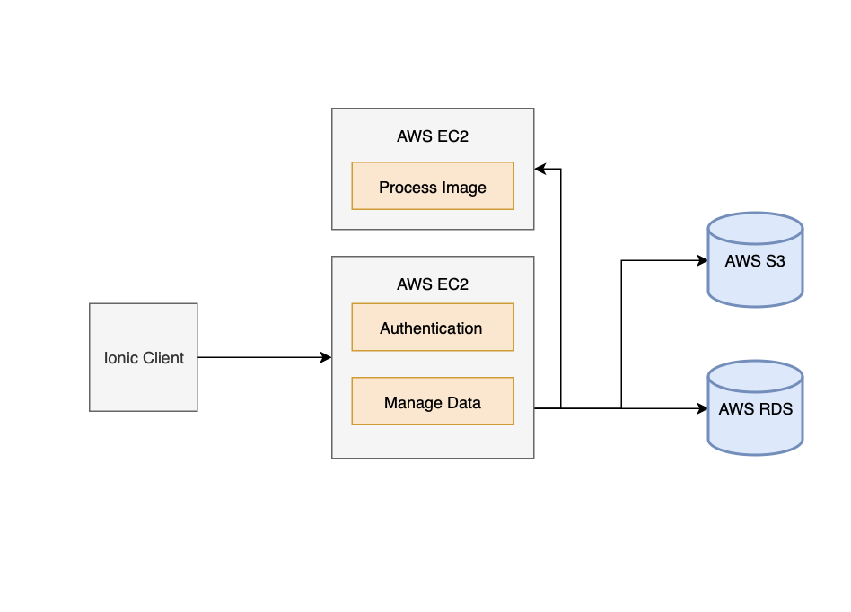

# Udagram
This repo contains answers to the assignment. If you are currently taking the course, spoilers beware!

Tasks completed:
1) Practice handeling routing in Nodejs/Express with the Practice_Server
- GET
- POST
- PATCH
- DELETE

2) Deploying a Nodejs/Express RestAPI servere with the RestAPI_Server
- Add/Remove images from an S3 bucket
- Authenticate with JWT and store user/pass in AWS RDS

3) Testing RestAPI with boilerplate Ionic server with the Front_End_Server
- Login
- Add image/comment

4) Deploying a secong Nodejs/Express RestAPI server with the Image_Filter_Server
- Image processing with Jimp based on RESTful queries
- Added features include basic authentication and URL validation

Click into each of the folders for more information.
