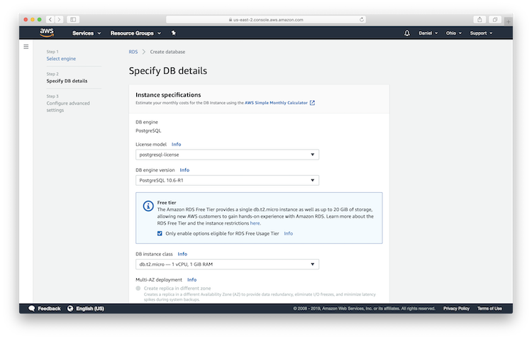
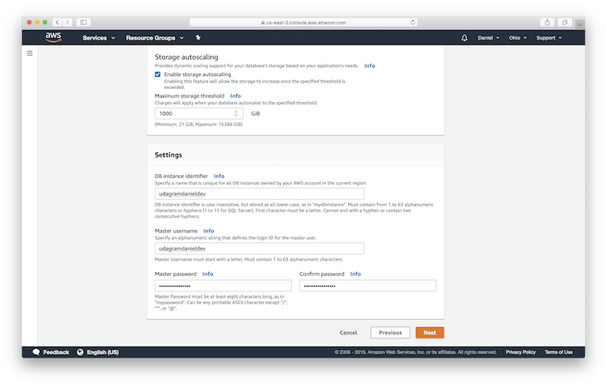
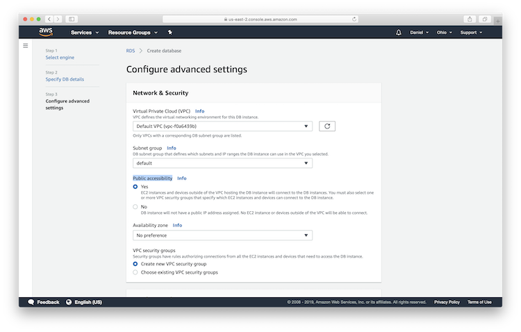
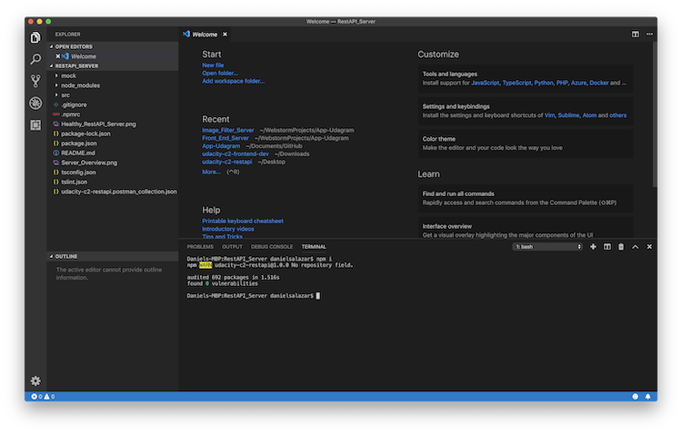
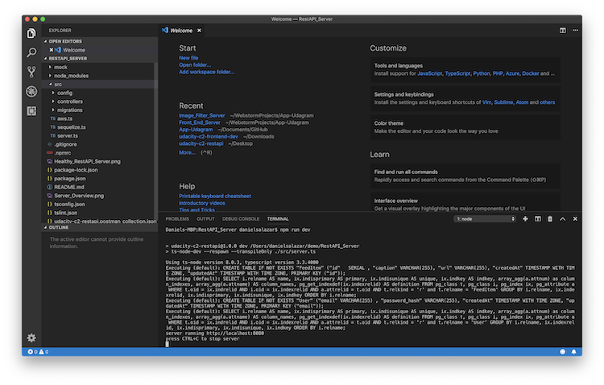
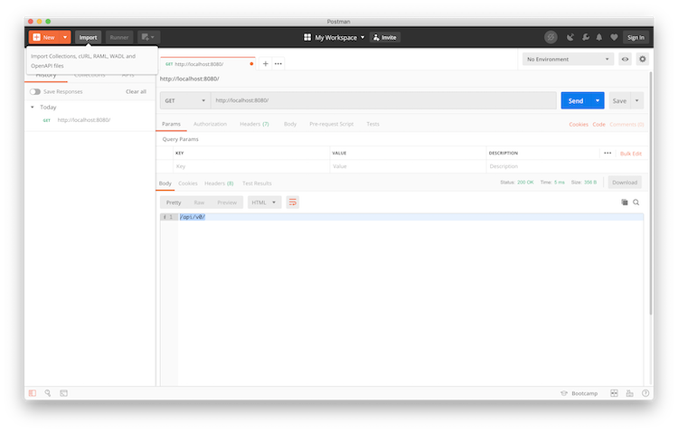
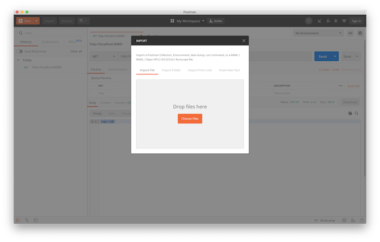

# RestAPI Server

The RestAPI Server (bottom server) is a nodejs/typescript cloud server which
* Manages user authentication, storing emails and password hashes in an AWS Relational Database Service (DB)
* Manages user data, storing images in an AWS Simple Storage Service (FS)
* Manages image filters using the Image_Filter_Server (top server)

### Prerequisites

* Nodejs and NPM
* Postman
* Postbird
* Visual Studio Code
* Amazon Web Services Account
* AWS CLI

### Installing

The server is dependent on Nodejs and Node Package Manager. 
* Installation instructions can be found [here](https://nodejs.org/en/download/)
* To test if Nodejs is installed, execute the following code in your terminal: `npm -v`

We can issue and save requests to the server with ease using Postman. 
* Installation instruction can be found [here](https://www.getpostman.com/downloads/).

We can interact with our database with ease using Postbird.
* Installation instructions can be found [here](https://github.com/paxa/postbird).

We can interact with our repo with ease using Visual Studio Code.
* Installation instructions can be found [here](https://code.visualstudio.com/docs/setup/setup-overview).

We will be using multiple services provided by Amazon Web Services, so you will need to set up an account.
* Instructions can be found [here](https://aws.amazon.com/premiumsupport/knowledge-center/create-and-activate-aws-account/).

We will be interacting with our AWS services using the command line, so you will need the AWS CLI
* Instructions can be found [here](https://docs.aws.amazon.com/cli/latest/userguide/cli-chap-install.html).
* To test if aws-cli is installed, execute the following code in your terminal: `aws --version`

## Getting Started

These instructions will get you a copy of the project up and running on your local machine for development and 
testing purposes. See deployment for notes on how to deploy the project on a live system.

### Setting up the database

* Go to the main page of AWS
* Search for RDS and click RDS

* Click ‘Create Database’

  - Select PostGres SQL and Check the radio button “Only enable options eligible for RDS Free Usage Tier”
  
  - Click next 
* Database Details:
  - Keep the Instance Specifications at their default settings. Be sure that your DB instance class is ‘db.t2.micro’
  
  - Enter in your own DB Instance Identifier 
    
  - In the Network & Security set Public accessibility to yes and keep the rest of the settings default
    
  - Database options - enter a database name and keep the rest default
  
  - Backup – keep everything default
  - Monitoring – keep everything default
  - Performance Insights - keep everything default
  
  - Log exports – select PostGresql log
  - Maintenance - keep everything default
  - Delete Protection – be sure the radio button is checked
  - Click Create Database

* Clone the repo

* Open the RestAPI_Server folder in Visual Studio Code

* Open a new terminal in Visual Studio Code
* To install the project’s dependencies, type in `npm i` and press enter

* To start the server, type in `npm run dev`

* The server can be located at `http://localhost:8080`

## Running the local tests

* Open Postman and close the startup menu
* Type in ` http://localhost:8080/` and hit send

  * Here we see the root response telling us that the api is located at /api/v0/
* You can import the provided test collections
  * Click the ‘Import’ button in the upper left
  
  * Click the ‘Choose Files’ button
  
  * Navigate to the RestAPI Server folder `App-Udagram-master > RestAPI_Server`
  * Open ‘RestAPI.postman_collection.json’ file
  
  * Click the ‘Collections’ button, below the ‘Import’ button
  
  * Here you will find three folders to test different features

Public:
- test getting all the images in the feed
- test getting a specific image
- test creating a new user with valid credentials
- test creating a new user with invalid credentials
- test loggin in with valid credentials
- test loggin in with invalid credentials

Unauthorized:
- test posting an image with invalid credentials

Authorized: 
- test posting an image with valid credentials and a malformed payload
- test posting an image with valid credentials and valid payload

## Deployment

Add additional notes about how to deploy this on a live system

You can deploy this server to the cloud using Amazon Web Services. Instructions to sign up can be 
found [here](https://portal.aws.amazon.com/billing/signup#/).

Interfacing with AWS can be done through the terminal, which will require AWS CLI. Installation instructions can
be found [here](https://docs.aws.amazon.com/cli/latest/userguide/cli-chap-install.html).

* To test if AWS CLI is installed, execute the following code in your terminal: `aws --version`

## Running the cloud tests

@TODO Finish cloud testing tutorial

Explain how to run the automated tests
Explain what is being tested and why
Give examples

## Built With

* [sequelize-typescript](https://www.npmjs.com/package/sequelize-typescript) a promise-based Node.js + typescrpt 
Object-Relational Mapping for PostgresSQL.
* [AWS CLI](https://aws.amazon.com/cli/) helps us manage our S3 and Elastic Beanstalk
services.
* [express](https://expressjs.com) framework helps us build our webserver. 
* [bcrypt](https://www.npmjs.com/package/bcrypt) library helps us hash passwords.
* [JsonWebToken](https://github.com/auth0/node-jsonwebtoken) library helps us manage tokens.
* [connect](https://www.npmjs.com/package/connect) library helps us glue together middleware.
* [email-validator](https://www.npmjs.com/package/email-validator) library helps us validate emails.
* [body-parser](https://github.com/expressjs/body-parser) helps us parse, remove, and make use of inbound requests.

## Authors
This repo was forked from Udacity's GitHub page as per the assignment
[udacity/cloud-developer](https://github.com/udacity/cloud-developer/tree/master/course-02)
* Udacity Cloud Developer authors: **[Udacity](https://github.com/eddyudacity)** and **[Michele Cavaioni](https://github.com/Udacavs)** for their *initial work*
* Udacity Cloud Developer student: **dSalazar10** for my participation in the exercises

## License

This project is licensed under the MIT License - see the [LICENSE](https://github.com/dSalazar10/App-Udagram/blob/master/LICENSE) file for details

## Acknowledgments

* Hat tip to [Gabe Ruttner](https://github.com/grutt) for teaching the lesson and providing the instructions to complete the assignments.
